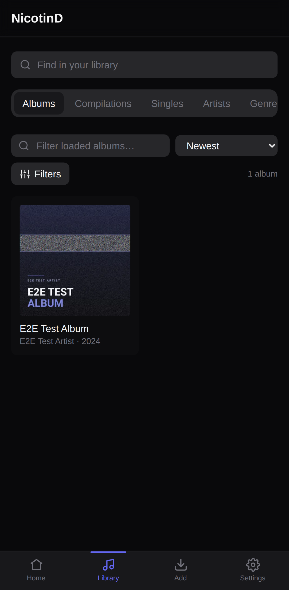
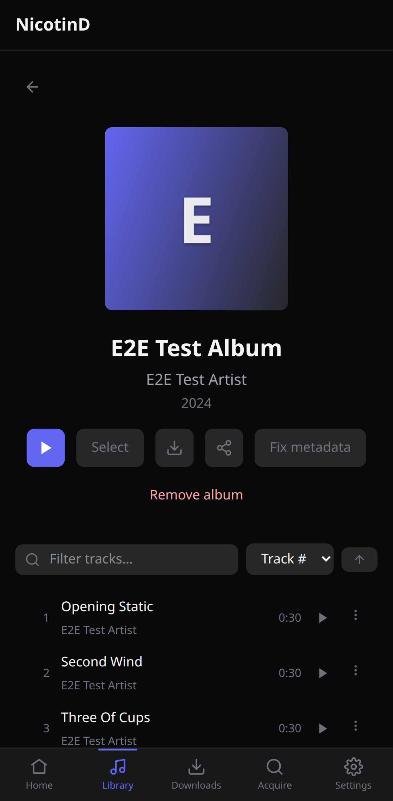
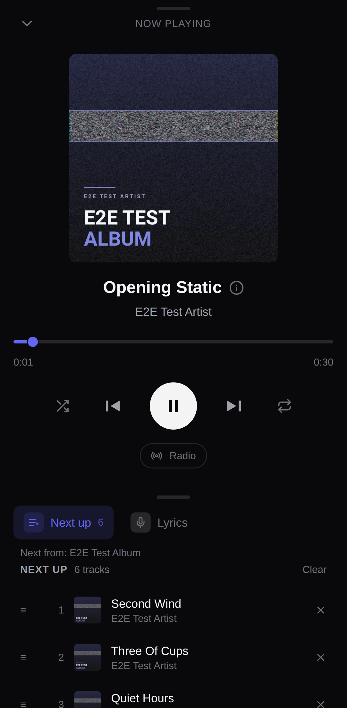
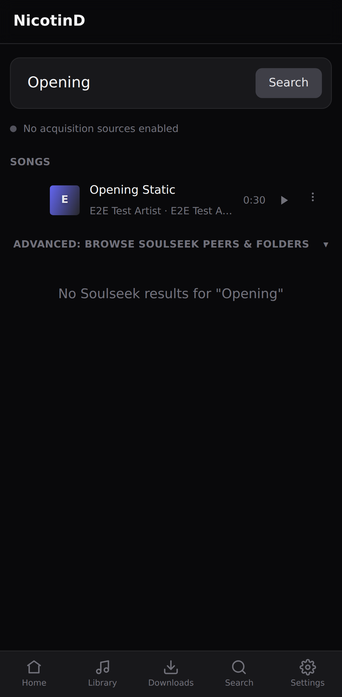

# NicotinD

<p align="center">
  <a href="https://github.com/kevinch3/NicotinD/releases/latest"></a>
  <a href="https://github.com/kevinch3/NicotinD/actions/workflows/ci.yml"></a>
  <a href="https://github.com/kevinch3/NicotinD/actions/workflows/deploy.yml"></a>
  <a href="https://github.com/kevinch3/NicotinD/pkgs/container/nicotind"></a>
  <a href="LICENSE"></a>
  <a href="#-documentation"></a>
</p>

**NicotinD is a self-hosted music server that finds the music too.** It natively
scans, streams, and enriches your library — and folds *acquisition* into the same
app: one search covers what you own **and** what you could get (Soulseek via
[slskd](https://github.com/slskd/slskd), YouTube, Spotify, archive.org), and
every result lands in the same organized, tagged, analyzed library.

- 🎵 **One blended search** — every acquirable result from any source is one
  ranked list with a single **Get** action; downloads are organized, scanned,
  transcoded, and enriched (BPM/key/genre/mood) before they land.
- 📱 **Every screen you own** — the same UI ships as a PWA, Android/iOS apps,
  an Electron desktop app, and an Android TV build; tracks can be saved for
  offline playback, and any device can cast to any other
  (Spotify-Connect-style) or to Chromecast/DLNA hardware.
- 🎚 **Smart playback** — metadata-driven radio (BPM/Camelot key/genre/mood
  similarity), karaoke-style synced lyrics with vocal mute, listening history +
  stats, native and auto-generated playlists.
- 🔒 **Self-hosted and multi-user** — one Docker container, roles from
  listener to admin, per-user settings on a shared library, opt-in everything
  (acquisition is a plugin system, off by default).

## Screenshots

<p align="center">
  
  
  
  
</p>

<p align="center"><sub>Core flows: Library grid · album detail · Now Playing queue · unified search — the local library blended with acquisition sources.</sub></p>

> Captured on the mobile UI via the Playwright screenshot flow (`packages/e2e`).
> Refresh the first three anytime with
> `bun run --filter @nicotind/e2e screens:readme`; the search shot needs a live
> slskd/Lidarr (`screens:live`) — see [docs/e2e.md](docs/e2e.md) "Screenshot
> flows".

## Quick start (Docker)

```bash
git clone https://github.com/kevinch3/NicotinD.git
cd NicotinD
docker compose up -d
```

Open `http://localhost:8484` — the setup wizard creates the admin account and
picks the music dir. No `.env` or manual config needed: the stack runs from the
published multi-arch image (`ghcr.io/kevinch3/nicotind`, amd64 + arm64). Soulseek
acquisition is opt-in — enable the `slskd-addon` profile and register the addon
under Extensions (see below). Install, upgrade, rollback, image tags, GPU
passthrough, and the lighter streaming-only profile:
**[docs/deployment.md](docs/deployment.md)**.

## How it works

```
docker compose up                    docker compose --profile slskd-addon up
┌───────────────────────────────────┐   ┌────────────────────────────────────┐
│  nicotind  :8484  (only exposed)   │   │  slskd addon  :8585   (opt-in)      │
│  API + web UI + native library     │   │  own repo + image:                 │
│  scanner + streaming               │◄──┤  ghcr.io/kevinch3/                 │
│                                    │   │       nicotind-slskd-addon         │
│  /data/music ◄── Library Scanner   │   │  drives slskd → Soulseek, delivers │
│                                    │   │  finished files to core over HTTP  │
└────────────────────────────────────┘   └────────────────────────────────────┘
       acquisition addon protocol (HTTP) — core carries zero slskd code
```

**NicotinD** (the only exposed service) is a Hono API + Angular web UI with the
native `LibraryScanner`, range-served audio streaming with an on-the-fly
transcode cache, cover art resolution, remote-playback WebSocket, and background
background enrichment. Soulseek acquisition is an **external, Torrentio-style
addon** — a separately-hosted service ([its own repo](https://github.com/kevinch3/nicotind-slskd-addon))
that speaks the acquisition addon protocol; core has no slskd code and talks to
it over HTTP. It downloads via slskd and delivers finished files back to core,
whose `DownloadWatcher` organizes and scans them into the canonical SQLite
library. URL acquisition (yt-dlp / spotdl / archive.org) is in-process and feeds
the same pipeline.

## Feature highlights

Each line links to the design doc with the full story.

- **Source-agnostic acquisition** — one adapter + one mapper per source, one blended results list → [docs/source-agnostic-acquisition.md](docs/source-agnostic-acquisition.md)
- **Album hunt** — guided "get this album" flow with match scoring, skewed queries, per-track fallback, watchlist auto-hunt → [docs/album-hunt.md](docs/album-hunt.md)
- **Download pipeline** — organize → dedupe → lossless→Opus → quarantine-until-enriched → land; provenance per track → [docs/download-pipeline.md](docs/download-pipeline.md)
- **Native library scanner** — tags → SQLite with deterministic IDs, incremental scan cache, multi-genre + multi-artist credits, VA/compilation handling → [docs/library-scanner.md](docs/library-scanner.md)
- **Audio ML enrichment** — BPM, Camelot key, energy, mood, danceability, embeddings via a local Essentia sidecar (CPU or GPU) → [docs/audio-ml-enrichment.md](docs/audio-ml-enrichment.md)
- **Smart radio** — weight-normalized similarity over BPM/key/genre/mood/embeddings; filter-seeded "vibe" stations; the post-login landing page → [docs/radio.md](docs/radio.md)
- **Remote playback** — any browser tab or device is a receiver; one device controls another → [docs/remote-playback.md](docs/remote-playback.md); hardware cast to Chromecast/DLNA → [docs/cast-integration.md](docs/cast-integration.md)
- **Offline (preserve) mode** — per-track and per-collection saves into IndexedDB with a storage budget and LRU eviction → [docs/web-ui.md](docs/web-ui.md)
- **Lyrics + karaoke** — plugin-sourced synced lyrics, fullscreen karaoke view, server-side vocal mute → [docs/design-patterns.md](docs/design-patterns.md)
- **Playlists** — native per-user, likes-backed "Liked Songs", curated shelves, recipe-generated auto playlists, playlist-from-acquisition → [docs/playlist-generation.md](docs/playlist-generation.md), [docs/automated-playlists.md](docs/automated-playlists.md)
- **Listening history & stats** — per-user play log with Last.fm-style counting, stats tab, recently-played shelf → [docs/listening-history.md](docs/listening-history.md)
- **Metadata curation** — Lidarr/MusicBrainz/Discogs candidates, cover picker, genre overrides + radar, artist identity fixes, licence tracking → [docs/metadata-optimize.md](docs/metadata-optimize.md), [docs/music-licence.md](docs/music-licence.md)
- **Multi-user + roles** — `listener < user < refiner < admin` ladder, per-user settings, presence, audit log → [docs/roles.md](docs/roles.md)
- **MCP agent access** — external LLM agents curate the library through scoped, revocable tokens → [docs/mcp-agent.md](docs/mcp-agent.md)
- **Plugin + addon architecture** — in-process acquisition/metadata/connectivity plugins (yt-dlp, spotdl, archive, spotify, LRCLIB, Discogs) plus external, Torrentio-style acquisition **addons** registered by URL (slskd is the first) → [docs/plugins.md](docs/plugins.md), [docs/acquisition-addon-protocol.md](docs/acquisition-addon-protocol.md)
- **Ops built in** — daily backups, config export/import, update check, Sentry opt-in, i18n (en/es) → [docs/backup-restore.md](docs/backup-restore.md), [docs/config-export.md](docs/config-export.md), [docs/observability.md](docs/observability.md), [docs/i18n.md](docs/i18n.md)

## 📚 Documentation

The `docs/` folder is the project's knowledge base — per-feature design docs
with the rationale, trade-offs, and measurements behind every pattern.
[CLAUDE.md](CLAUDE.md) is the always-loaded index of design patterns; the
tables below group every document by what you're trying to do.

### Install & operate

| Doc | What it covers |
| --- | --- |
| [deployment.md](docs/deployment.md) | Docker install, image tags, upgrade/rollback, GPU passthrough, streaming-only profile, incident runbooks |
| [configuration.md](docs/configuration.md) | Environment variables + `config/default.yml` reference |
| [onboarding.md](docs/onboarding.md) | Setup wizard + first-login flow |
| [backup-restore.md](docs/backup-restore.md) | Daily `VACUUM INTO` backups, retention, manual restore |
| [config-export.md](docs/config-export.md) | Portable config bundle export/import (host migration) |
| [prod-inspection.md](docs/prod-inspection.md) | Read-only prod DB probe (`prod-probe.ts`) |
| [oss-best-practices.md](docs/oss-best-practices.md) | Adopted Immich/Home-Assistant operational practices roadmap |
| [dependency-management.md](docs/dependency-management.md) | Update strategy, deliberately-held majors, automation plan |
| [releasing.md](docs/releasing.md) | How releases cut themselves; what ships per tag; manual overrides |

### Apps & devices

| Doc | What it covers |
| --- | --- |
| [mobile-app.md](docs/mobile-app.md) | Capacitor Android app, background audio, offline detection, APK self-update |
| [ios-app.md](docs/ios-app.md) | iOS shell, `MPNowPlayingInfoCenter` plugin, sideloading |
| [desktop-app.md](docs/desktop-app.md) | Electron app, backend sidecar, tray, packaging, auto-update |
| [tv-ux.md](docs/tv-ux.md) | Android TV surface: D-pad navigation, 10-foot player, route-level fork |
| [device-pairing.md](docs/device-pairing.md) | QR pairing, saved-server registry, Tailscale Funnel remote access |
| [remote-playback.md](docs/remote-playback.md) | Spotify-Connect-style device casting over WebSocket |
| [cast-integration.md](docs/cast-integration.md) | Chromecast + DLNA server-side cast controller |

### Acquisition

| Doc | What it covers |
| --- | --- |
| [source-agnostic-acquisition.md](docs/source-agnostic-acquisition.md) | The north star: one candidate model, one blended list, unified search, the `/get` workspace |
| [album-hunt.md](docs/album-hunt.md) | Hunt scoring, skewed queries, catalog search, watchlist, idempotency |
| [download-pipeline.md](docs/download-pipeline.md) | Watcher → organizer → scanner; dedupe, Opus standardization, release types, quality chips |
| [acquisition-jobs.md](docs/acquisition-jobs.md) | Unified job lifecycle, transfer↔job linkage, honest partials |
| [download-review.md](docs/download-review.md) | Hold-for-review inbox: triage, AcoustID identify, retagging |
| [playlist-from-acquisition.md](docs/playlist-from-acquisition.md) | URL acquire job → auto-generated playlist |
| [spotify-fallback.md](docs/spotify-fallback.md) | spotDL metadata lane + Spotify credential inheritance |
| [auto-acquisition-plan.md](docs/auto-acquisition-plan.md) | Opt-in Lidarr wanted/missing sweep |
| [plugins.md](docs/plugins.md) | Plugin kernel, registry, Extensions UI, per-plugin config |
| [discogs-plugin.md](docs/discogs-plugin.md) | Discogs metadata plugin: rate limiting, MBID-first matching, genre vocab |

### Library, metadata & enrichment

| Doc | What it covers |
| --- | --- |
| [library-scanner.md](docs/library-scanner.md) | Scanning, tag resolution, IDs, artist identity, search matching, streaming + cover art |
| [library-processing.md](docs/library-processing.md) | Background enrichment task registry, quarantine gate, failure ledger |
| [audio-ml-enrichment.md](docs/audio-ml-enrichment.md) | Essentia sidecar, perceptual features, embeddings, measured GPU behaviour |
| [library-filters.md](docs/library-filters.md) | The shared `LibraryFilter` grammar across all tabs |
| [library-audit.md](docs/library-audit.md) | Quality auditor: audit / clean / prevent for DJ-pool pollution |
| [metadata-optimize.md](docs/metadata-optimize.md) | Bulk Lidarr re-fetch + user-driven metadata fixes |
| [music-licence.md](docs/music-licence.md) | Per-track licence codes, layered retrieval, filtering |
| [popularity.md](docs/popularity.md) | ListenBrainz-backed popularity signal |
| [genre-radar.md](docs/genre-radar.md) | Genre distribution radar + strip, album genre aggregates |
| [cache-invalidation.md](docs/cache-invalidation.md) | Every cache/memo with its writer set; orphan pruning; the "adding a cache" checklist |

### Playback & discovery

| Doc | What it covers |
| --- | --- |
| [radio.md](docs/radio.md) | Similarity scoring, filter-seeded vibes, diagnostic dump tooling |
| [listening-history.md](docs/listening-history.md) | Play events, counting rules, stats |
| [playlist-generation.md](docs/playlist-generation.md) | Native playlists, the merged playlists page |
| [curated-playlists.md](docs/curated-playlists.md) | System-global curated shelves |
| [automated-playlists.md](docs/automated-playlists.md) | Recipe-driven refreshed playlists |
| [song-actions.md](docs/song-actions.md) | The unified song menu, likes, multi-select |
| [web-ui.md](docs/web-ui.md) | Angular patterns, theming, player internals, offline mode, page idioms |

### Access, integration & platform

| Doc | What it covers |
| --- | --- |
| [roles.md](docs/roles.md) | The four-role ladder, guards, audit log |
| [api-routes.md](docs/api-routes.md) | HTTP surface orientation map (`/openapi.json` is the contract) |
| [mcp-agent.md](docs/mcp-agent.md) | MCP endpoint, agent tokens, tool access rules |
| [oauth-auth.md](docs/oauth-auth.md) | Google/Microsoft login design (proposed, not yet implemented) |
| [presence-tracking.md](docs/presence-tracking.md) | Ephemeral admin-only presence |
| [observability.md](docs/observability.md) | Opt-in Sentry on web + API |
| [i18n.md](docs/i18n.md) | Runtime-JSON translations, language coverage |
| [design-patterns.md](docs/design-patterns.md) | Cross-cutting patterns without a dedicated doc |
| [admin-settings-decoupling.md](docs/admin-settings-decoupling.md) | Admin / Settings / Extensions split |

### Testing & development process

| Doc | What it covers |
| --- | --- |
| [e2e.md](docs/e2e.md) | Playwright suite, fixtures, screenshot flows, what the env does NOT give you |
| [e2e-tv-emulator.md](docs/e2e-tv-emulator.md) | Android TV emulator lane (real APK on an AVD) |
| [testing-routines.md](docs/testing-routines.md) | Flow catalogue + recurring test routines |

<details>
<summary><strong>Research notes & field logs</strong> (dated, exploratory — kept for the record)</summary>

| Doc | What it covers |
| --- | --- |
| [feedback-log-2026-08.md](docs/feedback-log-2026-08.md) | Rolling real-use friction log (current month) |
| [feedback-log-2026-07.md](docs/feedback-log-2026-07.md) · [feedback-log-2026-06.md](docs/feedback-log-2026-06.md) | Earlier months |
| [usage-analysis-2026-06.md](docs/usage-analysis-2026-06.md) | Usage analysis snapshot |
| [e2e-playground-findings-2026-06.md](docs/e2e-playground-findings-2026-06.md) | Playground harness findings |
| [library-ux-restructure.md](docs/library-ux-restructure.md) | Library UX restructure notes |
| [onnx-runtime-spike.md](docs/onnx-runtime-spike.md) · [client-side-ml-feasibility.md](docs/client-side-ml-feasibility.md) | ML runtime spikes |
| [intro-video-script.md](docs/intro-video-script.md) | Intro video script |
| `docs/measurements/` | Raw measurement data referenced by the docs above |

</details>

## Development

```bash
bun install              # Bun >= 1.1, Node >= 22.22.3 (for ng build)
bun run src/main.ts      # start the server (embedded mode)
bun run verify           # every CI gate in one command — run before pushing
bun run e2e              # Playwright end-to-end suite
```

See **[CONTRIBUTING.md](CONTRIBUTING.md)** for the full setup, the three
quality gates every change must pass, the TDD workflow, and commit
conventions. The monorepo layout is described in
[CLAUDE.md](CLAUDE.md#architecture); per-feature design detail lives in the
[documentation index](#-documentation) above.

## Community

- **Bugs & feature requests** — [GitHub Issues](https://github.com/kevinch3/NicotinD/issues)
- **Contributing** — [CONTRIBUTING.md](CONTRIBUTING.md)
- **Code of conduct** — [CODE_OF_CONDUCT.md](CODE_OF_CONDUCT.md)

## License

NicotinD is free software licensed under the
[GNU Affero General Public License v3.0](LICENSE) (AGPL-3.0-only).
